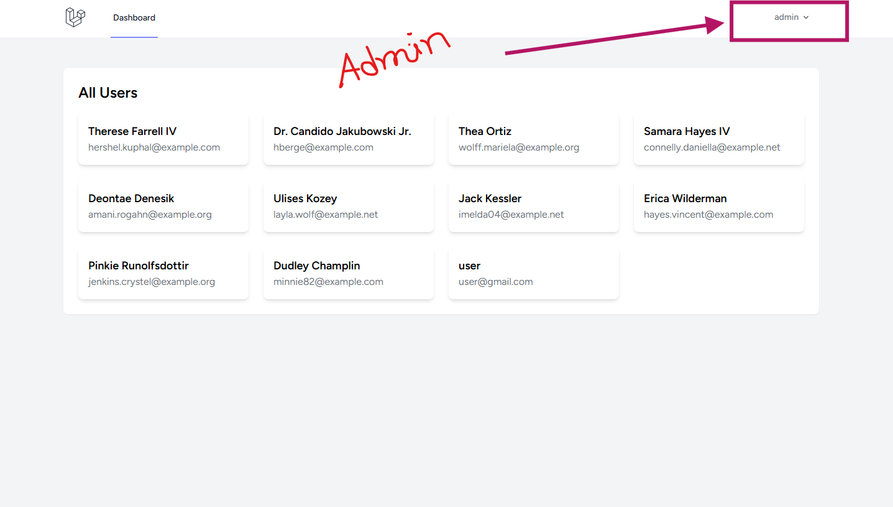
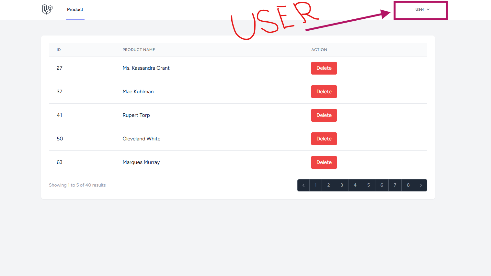
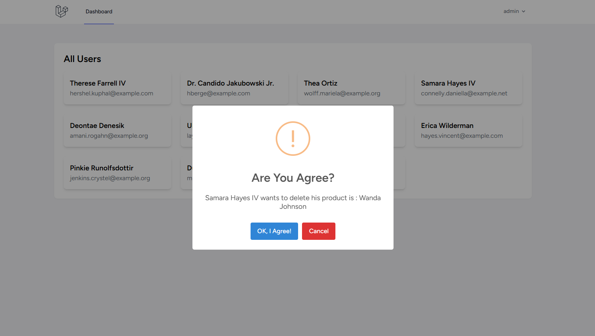
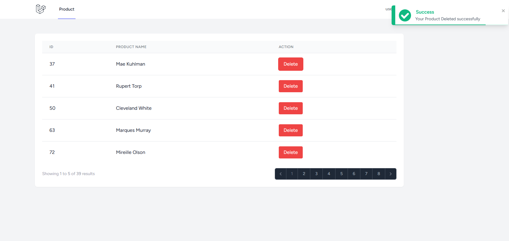
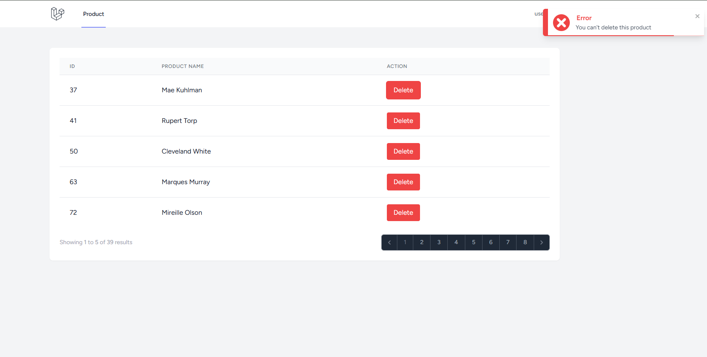

# Product Deletion Approval System | Laravel, Livewire & Reverb

A web application built with Laravel, Livewire, and Reverb, where users can request to delete their products. The deletion request requires admin approval before the product is permanently removed. The process is handled with real-time notifications, ensuring that both users and admins receive instant updates on the request status. Admins can accept or decline the request in real-time, and the product will only be deleted upon approval.

## Project Gallery

<div align="center">
  
  
  
  
  
</div>


## Installation Guide 🏗️


1. **Clone the repository:**

```shell
git clone https://github.com/EmamHosain/product-deletion-approval-laravel-reverb.git
cd product-deletion-approval-laravel-reverb

```
2. **Copy .env file**

```shell
cp .env.example .env
php artisan key:generate

```

3. **Update .env file**

```shell
DB_CONNECTION=mysql
DB_DATABASE=your_database
DB_USERNAME=your_username
DB_PASSWORD=your_password
APP_URL=http://localhost

```

4. **Install dependencies:**

```shell
composer install
npm install
npm run dev
```

5. **Generate Admin nad Some Fake Users and Products**
   
```shell
php artisan migrate:fresh --seed
```
   
5. **Run the application:**

```shell
php artisan serve
php artisan reverb:start --debug
```
